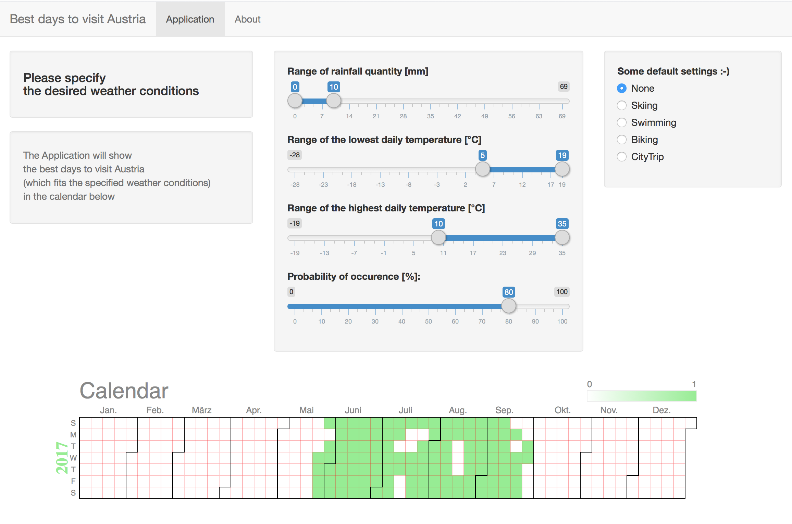

Best time to visit Austria
========================================================
author: peterkaj
date: March 7 2017
transition: rotate

Coursera<br> Data Science Specialization Course

Module<br> Developing Data Products


Why should i use the app?
========================================================
* With this Application it is possible to find some days to visit Austria which fits to the specified weather conditions.
* When is the best time for skiing, swimming, a city-trip, .... <br>-> get the answer with the app :-)

<div align="center">

</div>


How does it work? 1/2
========================================================
<small>
Out of the original daily weather data i created a data set which contains day of a year, rainvolume, lowest & highest daily temperature for every day of the years between 1948 and 2009 - like this...</small>


```
   date rain      tmin   tmax
1 01/01    0 -8.033333 -3.000
2 01/01    0 -4.850000  6.000
3 01/01    0 -8.825000 -1.325
```
<small>
in a next step the probability of occurence for some specific weather data is calculated - for instance ...<br><br>
-->   rainfall from 0 to 30mm <br>
-->   lowest temp. from -2 to 14°C <br>
-->   highest temp. from 3 to 32°C <br></small>

How does it work? 2/2
========================================================
<small>... which results in probabilities like ...

```
   date prain     ptmin     ptmax
1 01/01     1 0.2258065 0.3548387
2 01/02     1 0.2580645 0.3225806
3 01/03     1 0.3225806 0.2741935
```

A probability of 80% (0.8) means:<br>
<small>If you visit Austria every year at the same day for 10 years, then you may find the specified weather conditions 8 times at that day.</small>

At a day, where the probability of every weather condition is higher than the specified one, you will visit Austria and it is displayed in the GoogleVis calendar.</small>
<!-- Calendar generated in R 3.3.2 by googleVis 0.6.2 package -->
<!-- Wed Mar  8 19:42:56 2017 -->


<!-- jsHeader -->
<script type="text/javascript">
 
// jsData 
function gvisDataCalendarID799b1d8ed2e8 () {
var data = new google.visualization.DataTable();
var datajson =
[
 [
new Date(2017,0,1,0,0,0),
0
],
[
new Date(2017,0,2,0,0,0),
0
],
[
new Date(2017,0,3,0,0,0),
0
],
[
new Date(2017,0,4,0,0,0),
0
],
[
new Date(2017,0,5,0,0,0),
0
],
[
new Date(2017,0,6,0,0,0),
0
],
[
new Date(2017,0,7,0,0,0),
0
],
[
new Date(2017,0,8,0,0,0),
0
],
[
new Date(2017,0,9,0,0,0),
0
],
[
new Date(2017,0,10,0,0,0),
0
],
[
new Date(2017,0,11,0,0,0),
0
],
[
new Date(2017,0,12,0,0,0),
0
],
[
new Date(2017,0,13,0,0,0),
0
],
[
new Date(2017,0,14,0,0,0),
0
],
[
new Date(2017,0,15,0,0,0),
0
],
[
new Date(2017,0,16,0,0,0),
0
],
[
new Date(2017,0,17,0,0,0),
0
],
[
new Date(2017,0,18,0,0,0),
0
],
[
new Date(2017,0,19,0,0,0),
0
],
[
new Date(2017,0,20,0,0,0),
0
],
[
new Date(2017,0,21,0,0,0),
0
],
[
new Date(2017,0,22,0,0,0),
0
],
[
new Date(2017,0,23,0,0,0),
0
],
[
new Date(2017,0,24,0,0,0),
0
],
[
new Date(2017,0,25,0,0,0),
0
],
[
new Date(2017,0,26,0,0,0),
0
],
[
new Date(2017,0,27,0,0,0),
0
],
[
new Date(2017,0,28,0,0,0),
0
],
[
new Date(2017,0,29,0,0,0),
0
],
[
new Date(2017,0,30,0,0,0),
0
],
[
new Date(2017,0,31,0,0,0),
0
],
[
new Date(2017,1,1,0,0,0),
0
],
[
new Date(2017,1,2,0,0,0),
0
],
[
new Date(2017,1,3,0,0,0),
0
],
[
new Date(2017,1,4,0,0,0),
0
],
[
new Date(2017,1,5,0,0,0),
0
],
[
new Date(2017,1,6,0,0,0),
0
],
[
new Date(2017,1,7,0,0,0),
0
],
[
new Date(2017,1,8,0,0,0),
0
],
[
new Date(2017,1,9,0,0,0),
0
],
[
new Date(2017,1,10,0,0,0),
0
],
[
new Date(2017,1,11,0,0,0),
0
],
[
new Date(2017,1,12,0,0,0),
0
],
[
new Date(2017,1,13,0,0,0),
0
],
[
new Date(2017,1,14,0,0,0),
0
],
[
new Date(2017,1,15,0,0,0),
0
],
[
new Date(2017,1,16,0,0,0),
0
],
[
new Date(2017,1,17,0,0,0),
0
],
[
new Date(2017,1,18,0,0,0),
0
],
[
new Date(2017,1,19,0,0,0),
0
],
[
new Date(2017,1,20,0,0,0),
0
],
[
new Date(2017,1,21,0,0,0),
0
],
[
new Date(2017,1,22,0,0,0),
0
],
[
new Date(2017,1,23,0,0,0),
0
],
[
new Date(2017,1,24,0,0,0),
0
],
[
new Date(2017,1,25,0,0,0),
0
],
[
new Date(2017,1,26,0,0,0),
0
],
[
new Date(2017,1,27,0,0,0),
0
],
[
new Date(2017,1,28,0,0,0),
0
],
[
new Date(2017,2,1,0,0,0),
0
],
[
new Date(2017,2,2,0,0,0),
0
],
[
new Date(2017,2,3,0,0,0),
0
],
[
new Date(2017,2,4,0,0,0),
1
],
[
new Date(2017,2,5,0,0,0),
0
],
[
new Date(2017,2,6,0,0,0),
0
],
[
new Date(2017,2,7,0,0,0),
1
],
[
new Date(2017,2,8,0,0,0),
0
],
[
new Date(2017,2,9,0,0,0),
1
],
[
new Date(2017,2,10,0,0,0),
1
],
[
new Date(2017,2,11,0,0,0),
1
],
[
new Date(2017,2,12,0,0,0),
1
],
[
new Date(2017,2,13,0,0,0),
1
],
[
new Date(2017,2,14,0,0,0),
1
],
[
new Date(2017,2,15,0,0,0),
1
],
[
new Date(2017,2,16,0,0,0),
1
],
[
new Date(2017,2,17,0,0,0),
1
],
[
new Date(2017,2,18,0,0,0),
1
],
[
new Date(2017,2,19,0,0,0),
1
],
[
new Date(2017,2,20,0,0,0),
1
],
[
new Date(2017,2,21,0,0,0),
1
],
[
new Date(2017,2,22,0,0,0),
1
],
[
new Date(2017,2,23,0,0,0),
1
],
[
new Date(2017,2,24,0,0,0),
1
],
[
new Date(2017,2,25,0,0,0),
1
],
[
new Date(2017,2,26,0,0,0),
1
],
[
new Date(2017,2,27,0,0,0),
1
],
[
new Date(2017,2,28,0,0,0),
1
],
[
new Date(2017,2,29,0,0,0),
1
],
[
new Date(2017,2,30,0,0,0),
1
],
[
new Date(2017,2,31,0,0,0),
1
],
[
new Date(2017,3,1,0,0,0),
1
],
[
new Date(2017,3,2,0,0,0),
1
],
[
new Date(2017,3,3,0,0,0),
1
],
[
new Date(2017,3,4,0,0,0),
1
],
[
new Date(2017,3,5,0,0,0),
1
],
[
new Date(2017,3,6,0,0,0),
1
],
[
new Date(2017,3,7,0,0,0),
1
],
[
new Date(2017,3,8,0,0,0),
1
],
[
new Date(2017,3,9,0,0,0),
1
],
[
new Date(2017,3,10,0,0,0),
1
],
[
new Date(2017,3,11,0,0,0),
1
],
[
new Date(2017,3,12,0,0,0),
1
],
[
new Date(2017,3,13,0,0,0),
1
],
[
new Date(2017,3,14,0,0,0),
1
],
[
new Date(2017,3,15,0,0,0),
1
],
[
new Date(2017,3,16,0,0,0),
1
],
[
new Date(2017,3,17,0,0,0),
1
],
[
new Date(2017,3,18,0,0,0),
1
],
[
new Date(2017,3,19,0,0,0),
1
],
[
new Date(2017,3,20,0,0,0),
1
],
[
new Date(2017,3,21,0,0,0),
1
],
[
new Date(2017,3,22,0,0,0),
1
],
[
new Date(2017,3,23,0,0,0),
1
],
[
new Date(2017,3,24,0,0,0),
1
],
[
new Date(2017,3,25,0,0,0),
1
],
[
new Date(2017,3,26,0,0,0),
1
],
[
new Date(2017,3,27,0,0,0),
1
],
[
new Date(2017,3,28,0,0,0),
1
],
[
new Date(2017,3,29,0,0,0),
1
],
[
new Date(2017,3,30,0,0,0),
1
],
[
new Date(2017,4,1,0,0,0),
1
],
[
new Date(2017,4,2,0,0,0),
1
],
[
new Date(2017,4,3,0,0,0),
1
],
[
new Date(2017,4,4,0,0,0),
1
],
[
new Date(2017,4,5,0,0,0),
1
],
[
new Date(2017,4,6,0,0,0),
1
],
[
new Date(2017,4,7,0,0,0),
1
],
[
new Date(2017,4,8,0,0,0),
1
],
[
new Date(2017,4,9,0,0,0),
1
],
[
new Date(2017,4,10,0,0,0),
1
],
[
new Date(2017,4,11,0,0,0),
1
],
[
new Date(2017,4,12,0,0,0),
1
],
[
new Date(2017,4,13,0,0,0),
1
],
[
new Date(2017,4,14,0,0,0),
1
],
[
new Date(2017,4,15,0,0,0),
1
],
[
new Date(2017,4,16,0,0,0),
1
],
[
new Date(2017,4,17,0,0,0),
1
],
[
new Date(2017,4,18,0,0,0),
1
],
[
new Date(2017,4,19,0,0,0),
1
],
[
new Date(2017,4,20,0,0,0),
1
],
[
new Date(2017,4,21,0,0,0),
1
],
[
new Date(2017,4,22,0,0,0),
1
],
[
new Date(2017,4,23,0,0,0),
1
],
[
new Date(2017,4,24,0,0,0),
1
],
[
new Date(2017,4,25,0,0,0),
1
],
[
new Date(2017,4,26,0,0,0),
1
],
[
new Date(2017,4,27,0,0,0),
1
],
[
new Date(2017,4,28,0,0,0),
1
],
[
new Date(2017,4,29,0,0,0),
1
],
[
new Date(2017,4,30,0,0,0),
1
],
[
new Date(2017,4,31,0,0,0),
1
],
[
new Date(2017,5,1,0,0,0),
1
],
[
new Date(2017,5,2,0,0,0),
1
],
[
new Date(2017,5,3,0,0,0),
1
],
[
new Date(2017,5,4,0,0,0),
1
],
[
new Date(2017,5,5,0,0,0),
1
],
[
new Date(2017,5,6,0,0,0),
1
],
[
new Date(2017,5,7,0,0,0),
1
],
[
new Date(2017,5,8,0,0,0),
1
],
[
new Date(2017,5,9,0,0,0),
1
],
[
new Date(2017,5,10,0,0,0),
1
],
[
new Date(2017,5,11,0,0,0),
1
],
[
new Date(2017,5,12,0,0,0),
1
],
[
new Date(2017,5,13,0,0,0),
1
],
[
new Date(2017,5,14,0,0,0),
1
],
[
new Date(2017,5,15,0,0,0),
1
],
[
new Date(2017,5,16,0,0,0),
1
],
[
new Date(2017,5,17,0,0,0),
1
],
[
new Date(2017,5,18,0,0,0),
1
],
[
new Date(2017,5,19,0,0,0),
1
],
[
new Date(2017,5,20,0,0,0),
1
],
[
new Date(2017,5,21,0,0,0),
1
],
[
new Date(2017,5,22,0,0,0),
1
],
[
new Date(2017,5,23,0,0,0),
1
],
[
new Date(2017,5,24,0,0,0),
1
],
[
new Date(2017,5,25,0,0,0),
1
],
[
new Date(2017,5,26,0,0,0),
1
],
[
new Date(2017,5,27,0,0,0),
1
],
[
new Date(2017,5,28,0,0,0),
1
],
[
new Date(2017,5,29,0,0,0),
1
],
[
new Date(2017,5,30,0,0,0),
1
],
[
new Date(2017,6,1,0,0,0),
1
],
[
new Date(2017,6,2,0,0,0),
1
],
[
new Date(2017,6,3,0,0,0),
1
],
[
new Date(2017,6,4,0,0,0),
1
],
[
new Date(2017,6,5,0,0,0),
1
],
[
new Date(2017,6,6,0,0,0),
1
],
[
new Date(2017,6,7,0,0,0),
1
],
[
new Date(2017,6,8,0,0,0),
1
],
[
new Date(2017,6,9,0,0,0),
1
],
[
new Date(2017,6,10,0,0,0),
1
],
[
new Date(2017,6,11,0,0,0),
1
],
[
new Date(2017,6,12,0,0,0),
1
],
[
new Date(2017,6,13,0,0,0),
1
],
[
new Date(2017,6,14,0,0,0),
1
],
[
new Date(2017,6,15,0,0,0),
1
],
[
new Date(2017,6,16,0,0,0),
1
],
[
new Date(2017,6,17,0,0,0),
1
],
[
new Date(2017,6,18,0,0,0),
1
],
[
new Date(2017,6,19,0,0,0),
1
],
[
new Date(2017,6,20,0,0,0),
1
],
[
new Date(2017,6,21,0,0,0),
1
],
[
new Date(2017,6,22,0,0,0),
1
],
[
new Date(2017,6,23,0,0,0),
1
],
[
new Date(2017,6,24,0,0,0),
1
],
[
new Date(2017,6,25,0,0,0),
1
],
[
new Date(2017,6,26,0,0,0),
1
],
[
new Date(2017,6,27,0,0,0),
1
],
[
new Date(2017,6,28,0,0,0),
1
],
[
new Date(2017,6,29,0,0,0),
1
],
[
new Date(2017,6,30,0,0,0),
1
],
[
new Date(2017,6,31,0,0,0),
1
],
[
new Date(2017,7,1,0,0,0),
1
],
[
new Date(2017,7,2,0,0,0),
1
],
[
new Date(2017,7,3,0,0,0),
1
],
[
new Date(2017,7,4,0,0,0),
1
],
[
new Date(2017,7,5,0,0,0),
1
],
[
new Date(2017,7,6,0,0,0),
1
],
[
new Date(2017,7,7,0,0,0),
1
],
[
new Date(2017,7,8,0,0,0),
1
],
[
new Date(2017,7,9,0,0,0),
1
],
[
new Date(2017,7,10,0,0,0),
1
],
[
new Date(2017,7,11,0,0,0),
1
],
[
new Date(2017,7,12,0,0,0),
1
],
[
new Date(2017,7,13,0,0,0),
1
],
[
new Date(2017,7,14,0,0,0),
1
],
[
new Date(2017,7,15,0,0,0),
1
],
[
new Date(2017,7,16,0,0,0),
1
],
[
new Date(2017,7,17,0,0,0),
1
],
[
new Date(2017,7,18,0,0,0),
1
],
[
new Date(2017,7,19,0,0,0),
1
],
[
new Date(2017,7,20,0,0,0),
1
],
[
new Date(2017,7,21,0,0,0),
1
],
[
new Date(2017,7,22,0,0,0),
1
],
[
new Date(2017,7,23,0,0,0),
1
],
[
new Date(2017,7,24,0,0,0),
1
],
[
new Date(2017,7,25,0,0,0),
1
],
[
new Date(2017,7,26,0,0,0),
1
],
[
new Date(2017,7,27,0,0,0),
1
],
[
new Date(2017,7,28,0,0,0),
1
],
[
new Date(2017,7,29,0,0,0),
1
],
[
new Date(2017,7,30,0,0,0),
1
],
[
new Date(2017,7,31,0,0,0),
1
],
[
new Date(2017,8,1,0,0,0),
1
],
[
new Date(2017,8,2,0,0,0),
1
],
[
new Date(2017,8,3,0,0,0),
1
],
[
new Date(2017,8,4,0,0,0),
1
],
[
new Date(2017,8,5,0,0,0),
1
],
[
new Date(2017,8,6,0,0,0),
1
],
[
new Date(2017,8,7,0,0,0),
1
],
[
new Date(2017,8,8,0,0,0),
1
],
[
new Date(2017,8,9,0,0,0),
1
],
[
new Date(2017,8,10,0,0,0),
1
],
[
new Date(2017,8,11,0,0,0),
1
],
[
new Date(2017,8,12,0,0,0),
1
],
[
new Date(2017,8,13,0,0,0),
1
],
[
new Date(2017,8,14,0,0,0),
1
],
[
new Date(2017,8,15,0,0,0),
1
],
[
new Date(2017,8,16,0,0,0),
1
],
[
new Date(2017,8,17,0,0,0),
1
],
[
new Date(2017,8,18,0,0,0),
1
],
[
new Date(2017,8,19,0,0,0),
1
],
[
new Date(2017,8,20,0,0,0),
1
],
[
new Date(2017,8,21,0,0,0),
1
],
[
new Date(2017,8,22,0,0,0),
1
],
[
new Date(2017,8,23,0,0,0),
1
],
[
new Date(2017,8,24,0,0,0),
1
],
[
new Date(2017,8,25,0,0,0),
1
],
[
new Date(2017,8,26,0,0,0),
1
],
[
new Date(2017,8,27,0,0,0),
1
],
[
new Date(2017,8,28,0,0,0),
1
],
[
new Date(2017,8,29,0,0,0),
1
],
[
new Date(2017,8,30,0,0,0),
1
],
[
new Date(2017,9,1,0,0,0),
1
],
[
new Date(2017,9,2,0,0,0),
1
],
[
new Date(2017,9,3,0,0,0),
1
],
[
new Date(2017,9,4,0,0,0),
1
],
[
new Date(2017,9,5,0,0,0),
1
],
[
new Date(2017,9,6,0,0,0),
1
],
[
new Date(2017,9,7,0,0,0),
1
],
[
new Date(2017,9,8,0,0,0),
1
],
[
new Date(2017,9,9,0,0,0),
1
],
[
new Date(2017,9,10,0,0,0),
1
],
[
new Date(2017,9,11,0,0,0),
1
],
[
new Date(2017,9,12,0,0,0),
1
],
[
new Date(2017,9,13,0,0,0),
1
],
[
new Date(2017,9,14,0,0,0),
1
],
[
new Date(2017,9,15,0,0,0),
1
],
[
new Date(2017,9,16,0,0,0),
1
],
[
new Date(2017,9,17,0,0,0),
1
],
[
new Date(2017,9,18,0,0,0),
1
],
[
new Date(2017,9,19,0,0,0),
1
],
[
new Date(2017,9,20,0,0,0),
1
],
[
new Date(2017,9,21,0,0,0),
1
],
[
new Date(2017,9,22,0,0,0),
1
],
[
new Date(2017,9,23,0,0,0),
1
],
[
new Date(2017,9,24,0,0,0),
1
],
[
new Date(2017,9,25,0,0,0),
1
],
[
new Date(2017,9,26,0,0,0),
1
],
[
new Date(2017,9,27,0,0,0),
1
],
[
new Date(2017,9,28,0,0,0),
1
],
[
new Date(2017,9,29,0,0,0),
1
],
[
new Date(2017,9,30,0,0,0),
1
],
[
new Date(2017,9,31,0,0,0),
1
],
[
new Date(2017,10,1,0,0,0),
1
],
[
new Date(2017,10,2,0,0,0),
1
],
[
new Date(2017,10,3,0,0,0),
1
],
[
new Date(2017,10,4,0,0,0),
1
],
[
new Date(2017,10,5,0,0,0),
1
],
[
new Date(2017,10,6,0,0,0),
1
],
[
new Date(2017,10,7,0,0,0),
1
],
[
new Date(2017,10,8,0,0,0),
1
],
[
new Date(2017,10,9,0,0,0),
1
],
[
new Date(2017,10,10,0,0,0),
1
],
[
new Date(2017,10,11,0,0,0),
1
],
[
new Date(2017,10,12,0,0,0),
1
],
[
new Date(2017,10,13,0,0,0),
1
],
[
new Date(2017,10,14,0,0,0),
1
],
[
new Date(2017,10,15,0,0,0),
1
],
[
new Date(2017,10,16,0,0,0),
1
],
[
new Date(2017,10,17,0,0,0),
1
],
[
new Date(2017,10,18,0,0,0),
0
],
[
new Date(2017,10,19,0,0,0),
1
],
[
new Date(2017,10,20,0,0,0),
1
],
[
new Date(2017,10,21,0,0,0),
1
],
[
new Date(2017,10,22,0,0,0),
1
],
[
new Date(2017,10,23,0,0,0),
0
],
[
new Date(2017,10,24,0,0,0),
0
],
[
new Date(2017,10,25,0,0,0),
0
],
[
new Date(2017,10,26,0,0,0),
1
],
[
new Date(2017,10,27,0,0,0),
1
],
[
new Date(2017,10,28,0,0,0),
0
],
[
new Date(2017,10,29,0,0,0),
1
],
[
new Date(2017,10,30,0,0,0),
0
],
[
new Date(2017,11,1,0,0,0),
0
],
[
new Date(2017,11,2,0,0,0),
0
],
[
new Date(2017,11,3,0,0,0),
0
],
[
new Date(2017,11,4,0,0,0),
0
],
[
new Date(2017,11,5,0,0,0),
0
],
[
new Date(2017,11,6,0,0,0),
0
],
[
new Date(2017,11,7,0,0,0),
0
],
[
new Date(2017,11,8,0,0,0),
0
],
[
new Date(2017,11,9,0,0,0),
0
],
[
new Date(2017,11,10,0,0,0),
0
],
[
new Date(2017,11,11,0,0,0),
0
],
[
new Date(2017,11,12,0,0,0),
0
],
[
new Date(2017,11,13,0,0,0),
0
],
[
new Date(2017,11,14,0,0,0),
0
],
[
new Date(2017,11,15,0,0,0),
0
],
[
new Date(2017,11,16,0,0,0),
0
],
[
new Date(2017,11,17,0,0,0),
0
],
[
new Date(2017,11,18,0,0,0),
0
],
[
new Date(2017,11,19,0,0,0),
0
],
[
new Date(2017,11,20,0,0,0),
0
],
[
new Date(2017,11,21,0,0,0),
0
],
[
new Date(2017,11,22,0,0,0),
0
],
[
new Date(2017,11,23,0,0,0),
0
],
[
new Date(2017,11,24,0,0,0),
0
],
[
new Date(2017,11,25,0,0,0),
0
],
[
new Date(2017,11,26,0,0,0),
0
],
[
new Date(2017,11,27,0,0,0),
0
],
[
new Date(2017,11,28,0,0,0),
0
],
[
new Date(2017,11,29,0,0,0),
0
],
[
new Date(2017,11,30,0,0,0),
0
],
[
new Date(2017,11,31,0,0,0),
0
] 
];
data.addColumn('datetime','date');
data.addColumn('number','ok');
data.addRows(datajson);
return(data);
}
 
// jsDrawChart
function drawChartCalendarID799b1d8ed2e8() {
var data = gvisDataCalendarID799b1d8ed2e8();
var options = {};
options["width"] = 1000;
options["height"] = 500;
options["title"] = "Calendar";
options["colorAxis"] = {minValue:0, maxValue:1, colors:['white', 'lightgreen']};
options["calendar"] = {yearLabel: { fontName: 'Times-Roman',
                                     fontSize: 24, color: 'lightgreen', bold: true},
                                     cellSize: 17,
                                     cellColor: { stroke: 'red', strokeOpacity: 0.2 },
                                     focusedCellColor: {stroke:'red'}};

    var chart = new google.visualization.Calendar(
    document.getElementById('CalendarID799b1d8ed2e8')
    );
    chart.draw(data,options);
    

}
  
 
// jsDisplayChart
(function() {
var pkgs = window.__gvisPackages = window.__gvisPackages || [];
var callbacks = window.__gvisCallbacks = window.__gvisCallbacks || [];
var chartid = "calendar";
  
// Manually see if chartid is in pkgs (not all browsers support Array.indexOf)
var i, newPackage = true;
for (i = 0; newPackage && i < pkgs.length; i++) {
if (pkgs[i] === chartid)
newPackage = false;
}
if (newPackage)
  pkgs.push(chartid);
  
// Add the drawChart function to the global list of callbacks
callbacks.push(drawChartCalendarID799b1d8ed2e8);
})();
function displayChartCalendarID799b1d8ed2e8() {
  var pkgs = window.__gvisPackages = window.__gvisPackages || [];
  var callbacks = window.__gvisCallbacks = window.__gvisCallbacks || [];
  window.clearTimeout(window.__gvisLoad);
  // The timeout is set to 100 because otherwise the container div we are
  // targeting might not be part of the document yet
  window.__gvisLoad = setTimeout(function() {
  var pkgCount = pkgs.length;
  google.load("visualization", "1", { packages:pkgs, callback: function() {
  if (pkgCount != pkgs.length) {
  // Race condition where another setTimeout call snuck in after us; if
  // that call added a package, we must not shift its callback
  return;
}
while (callbacks.length > 0)
callbacks.shift()();
} });
}, 100);
}
 
// jsFooter
</script>
 
<!-- jsChart -->  
<script type="text/javascript" src="https://www.google.com/jsapi?callback=displayChartCalendarID799b1d8ed2e8"></script>
 
<!-- divChart -->
  
<div id="CalendarID799b1d8ed2e8" 
  style="width: 1000; height: 500;">
</div>

Useful things
========================================================
- **default settings** allow a quick weather-setting for most likely activities
<div align="center">

</div>

- **Links**
<small><small>
Code@GitHub :  <https://github.com/peterkaj/Coursera_DDP/Visit_Austria/><br>
Shiny.App :  <https://peterka.shinyapps.io/visit_austria/><br>
Presentation : <https://github.com/peterkaj/Coursera_DDP/Visit_Austria_Presentation/><br>
Austria : <https://en.wikipedia.org/wiki/Austria><br>
DataSource : <small><https://www.zamg.ac.at/cms/de/klima/informationsportal-klimawandel/daten-download/tagesdaten></small>
</small></small>
